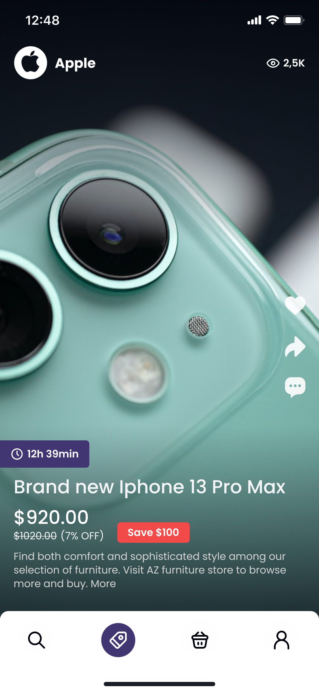

# Hiive
> Hiive is an e-Commerce mobile app, which is focused on brands and user experience.
> Live demo [_here_](https://www.example.com). <!-- If you have the project hosted somewhere, include the link here. -->

## Table of Contents
* [General Info](#general-information)
* [Technologies Used](#technologies-used)
* [Requirements](#requirements)
* [Features](#features)
* [Screenshots](#screenshots)
* [Setup](#setup)
* [Distibution](#distibution)
* [Usage](#usage)
* [Contact](#contact)
<!-- * [License](#license) -->
## General Information
What problem does it (intend to) solve?
- Modern way to tell a brand story on marketplace
- Brands will have branding options and way to collaborate with their customers.

What is the purpose of project?
- Lowest commission on the market.
- Hiive creates high-quality videos for each product with leading influencers, with top graphic design to engage audience and show brand story
- Hiive will present each product on
- The platform with limited discounts. Users will have a chance to purchase best products with the lowest price cross the market.
<!-- You don't have to answer all the questions - just the ones relevant to your project. -->
## Requirements 
- iOS 14
- Xcode 13
## Technologies Used
- Swift
- UIKit
- MVP Architecture 
## Features
- TikTok-like Feed with infinity scrolling feature
- Backet for buying products feture
- User profile feature
- Search feature
- Comments feature
- Product detais feature
- Referral program feature
- Share products feature
- Google login
- Apple login
- Facebook login

## Screenshots

<!-- If you have screenshots you'd like to share, include them here. -->
## Setup
1. Clone gitHub repo
2. Run pod install in terminal
3. Open Hiive.xcworkspace

For setup and a build project need Apple Signing Certificate
### Dependencies
The app uses some Cocoapods and SPM. These should not need touching in general as a copy
of the code and project files is included in the repo. Just remember to open the
 `Hiive.xcworkspace`, not the `Hiive.xcproject`. Cocoapods dependencies are listed in Podfile in projrct repository. SPM dependencies are listed in Package Dependencies list.

- Reusable - version 4.1.2
- NerdzNetworking - version 0.0.2
- NerdzUtils - version 41
- NerdzInject - version 1.1.1
- Hero - version 1.6.1
- NerdzValidation - version 1.0.1
- Nuke - version 9.0
- TagListView - version 1.0
- ImageViewer - version 6.0.6
- TinyConstraint - version 4.0
- SwiftGen - version 6.0
- SwiftLint - version 0.49.1
- ImageSlideshow - version 1.9
- Branck - version 1.0.1
- Firebase - version 9.5.0
### Enviroments
- Development Debug
- Development Release 
- Production Debug 
- Production Release 
### Distibution
- To distribute build for test use, Firebase Distribution and Development enviroment
- To distribute build for production use Firebase Distribution and Production enviroment
### Assets
The project use SwiftGen to work with Assets. 
- `Asset.Color.neededColor` - get color
- `Asset.Images.neededImages` - get image
- `Asset.Icons.neededIcon` - get icon
- `L10n.neededText` - get text
## Contact
Created by [NERDZ LAB](https://github.com/nerdzlab/) - feel free to contact us!

<!-- Optional -->
<!-- ## License -->
<!-- This project is open source and available under the [... License](). -->

<!-- You don't have to include all sections - just the one's relevant to your project -->
